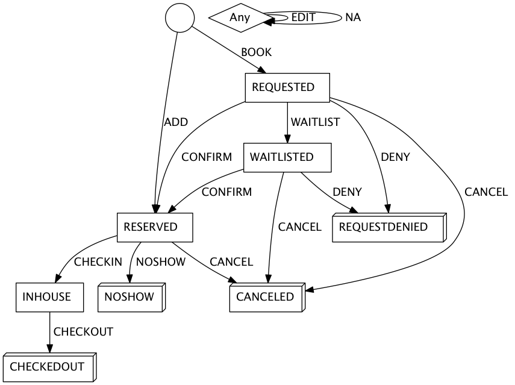

= Guest-stay message

A guest-stay message contains a single <<guestStay object>>.

== guestStay object

A guestStay object represents a past, current, or upcoming stay by a guest or guests at a property. It contains information about the location, duration and other details of the stay, as well as profile information about the guests and other associated entities.

.Fields of the `guestStay` object
|===
|Name |Type |Usage |Description |Example

|action
|string enum: `BOOK`, `ADD`, `WAITLIST`, `CONFIRM`, `DENY`, `CANCEL`, `CHECKIN`, `NOSHOW`, `CHECKOUT`, `EDIT`, `NA`
|`REQUIRED`
|Action that triggered the guest-stay message, see <<guestStay action string>>
|`"ADD"`

|property
|string
|`REQUIRED`
|Property code that the stay belongs to
|`"AVERTINE"`

|interfaceType
|string
|`INTERNAL`
|
|

|remoteSystemName
|string
|`INTERNAL`
|
|

|confirmationCode
|string
|`REQUIRED`
|ID of the stay
|`"30001"`

|statusCode
|string enum: `REQUESTED`, `RESERVED`, `WAITLISTED`, `REQUESTDENIED`, `INHOUSE`, `CANCELED`, `NOSHOW`, `CHECKEDOUT`
|`REQUIRED`
|Current status of the stay
|`"RESERVED"`

|guaranteeCode
|string
|`OPTIONAL`
|Code representing the type of guarantee for the stay
|`"CC"`

|lastUpdatedAt
|ISO8601 date-time string
|`RECOMMENDED`
|Time at which the stay was last updated
|`"2009-08-15T16:52:36.000-07:00"`

|lastUpdatedBy
|string
|`OPTIONAL`
|Name, username, or initials of the user or system that last updated the stay
|`"Test User"`

|bookingNumber
|string
|`SUGGESTED`
|ID assigned to the stay by the booking engine or central reservation system
|`"CRO-123A"`

|bookingDate
|ISO8601 date-time string
|`RECOMMENDED`
|Time at which the stay was booked
|`"2015-08-11T20:52:01.132Z"`

|bookedBy
|string
|`OPTIONAL`
|Name, username, or initials of the user or system that booked the stay
|`"Avertine Reservation System"`

|reservationSource
|string
|`SUGGESTED`
|Channel by which the stay was booked
|`"GDS"`

|cancellationNumber
|string
|`RECOMMENDED`
|ID assigned to the cancellation of the stay
|`"12345"`

|cancellationDate
|ISO8601 date-time string
|`RECOMMENDED`
|Time at which the stay was canceled
|`"2009-08-15T16:52:36.000-07:00"`

|canceledBy
|string
|`OPTIONAL`
|Name, username, or initials of the user or system that canceled the stay
|`"Jane Smith"`

|checkinDate
|ISO8601 date string
|`REQUIRED`
|Scheduled check-in date of the stay
|`"2015-12-31"`

|actualCheckinDate
|ISO8601 date-time string
|`SUGGESTED`
|Actual check-in time of the stay
|`"2015-12-31T16:52:36.123+05:00"`

|checkedInBy
|string
|`OPTIONAL`
|Name, username, or initials of the user or system that checked the guest in
|`"Alice"`

|checkoutDate
|ISO8601 date string
|`REQUIRED`
|Scheduled check-out date of the stay
|`"2015-12-31"`

|actualCheckoutDate
|ISO8601 date-time string
|`SUGGESTED`
|Actual check-out time of the stay
|`"2015-12-31T16:52:36.123Z"`

|checkedOutBy
|string
|`OPTIONAL`
|Name, username, or initials of the user or system that checked the guest out
|`"Bob"`

|stayLength
|<<stayLength object>>
|`RECOMMENDED`
|Length of the stay
|

|numberOfAdults
|integral number
|`SUGGESTED`
|Number of adults in the stay
|`2`

|numberOfChildren
|integral number
|`SUGGESTED`
|Number of children in the stay
|`0`

|roomNumber
|string
|`RECOMMENDED`
|Room number or room identifier
|`"WEST-102"`

|roomType
|string
|`SUGGESTED`
|Room type, preferably in code/short form
|`"KINGDLX"`

|roomTypeChargeCode
|string
|`SUGGESTED`
|Charge code of the room type or room identifier
|`"KING"`

|blockCode
|string
|`SUGGESTED`
|Block code of the stay
|`"KING-Block"`

|numberOfRooms
|integral number
|`OPTIONAL`
|Number of rooms of the stay
|`1`

|market
|string
|`SUGGESTED`
|Market name or code of the guest or stay
|`"Bay Area"`

|tripType
|string
|`OPTIONAL`
|Trip type of the stay
|`"BUSINESS"`

|travelAgency
|<<companyInfo object>>
|`DEPRECATED`
|Travel agency associated with the stay. Attach a <<profile object>> with *profileType* of `"TRAVEL"` to the stay instead of using this field.
|

|totalRoomRevenue
|<<monetaryAmount object>>
|`RECOMMENDED`
|Room revenue amount of the stay
|

|totalFoodAndBeverageRevenue
|<<monetaryAmount object>>
|`SUGGESTED`
|Food and beverage revenue amount of the stay
|

|totalLuggageRevenue
|<<monetaryAmount object>>
|`SUGGESTED`
|Luggage revenue amount of the stay
|

|totalOtherRevenue
|<<monetaryAmount object>>
|`SUGGESTED`
|Total of all revenue amounts excluding room, food, beverage, and luggage, of the stay
|

|totalTaxes
|<<monetaryValue object>>
|`DEPRECATED`
|Total of all taxes. Use the *tax* field in each <<monetaryAmount object>> instead.
|

|totalRemainingBalance
|<<monetaryValue object>>
|`SUGGESTED`
|Balance remaining on the stay
|

|totalDepositRequired
|<<monetaryValue object>>
|`SUGGESTED`
|Deposit amount required for the stay
|

|depositRequiredDate
|ISO8601 date string
|`OPTIONAL`
|Date on which deposit is due
|`"2015-12-31"`

|ratePlans
|array of <<ratePlan object,ratePlan objects>>
|`RECOMMENDED`
|Rate plans attached to the stay
|

|services
|array of <<service object,service objects>>
|`SUGGESTED`
|Services rendered during the stay
|

|profiles
|array of <<profile object,profile objects>>
|`REQUIRED`
|Profiles associated with the stay. A minimum of 1 profile with *profileType* `"GUEST"` is required.
|

|guestNotes
|array of <<guestNote object,guestNote objects>>
|`SUGGESTED`
|Notes attached to the stay
|

|pmsDefinedFields
|array of <<userDefinedField object,userDefinedField objects>>
|`OPTIONAL`
|PMS-defined fields
|

|propertyDefinedFields
|array of <<userDefinedField object,userDefinedField objects>>
|`OPTIONAL`
|Property-defined fields
|
|===

== stayLength object

A description of the length of stay

.Fields of the `stayLength` object
|===
|Name |Type |Usage |Description |Example

|stayLength
|integral number
|`REQUIRED`
|Number of days of the stay
|`3`

|stayLengthUnits
|string enum: `DAY`
|`DEPRECATED`
|Type of the time units of the stay length. Should be omitted as only `"DAY"` is possible.
|`"DAY"`
|===

== monetaryValue object

A monetary value consisting of a number and a currency

.Fields of the `monetaryValue` object
|===
|Name |Type |Usage |Description |Example

|value
|decimal number
|`REQUIRED`
|Number of units of the currency
|19.95

|currency
|string
|`RECOMMENDED`
|ISO4217 3-character currency code
|`"USD"`
|===

== monetaryAmount object

An amount of money with associated tax

.Fields of the `monetaryAmount` object
|===
|Name |Type |Usage |Description |Example

|amountBeforeTax
|<<monetaryValue object>>
|`RECOMMENDED`
|Amount before tax
|

|taxAmount
|<<monetaryValue object>>
|`RECOMMENDED`
|Tax amount
|

|value
|decimal number
|`DEPRECATED`
|Number of units of the currency of the pre-tax amount. Use *amountBeforeTax* instead.
|`19.95`

|currency
|string
|`DEPRECATED`
|ISO4217 3-character currency code of the pre-tax amount. Use *amountBeforeTax* instead.
|`"USD"`
|===

== rate object

A rate during a specific time period

.Fields of the `rate` object
|===
|Name |Type |Usage |Description |Example

|amount
|<<monetaryValue object>>
|`RECOMMENDED`
|Rate per time unit
|

|startTime
|ISO8601 date-time string
|`RECOMMENDED`
|Start time of the rate
|`"2016-07-22T00:00:00.000-07:00"`

|timeUnits
|integral number
|`RECOMMENDED`
|Number of time units of the rate
|`2`

|timeUnitType
|string enum: `DAY`, `HOUR`
|`RECOMMENDED`
|Type of the time units
|`"DAY"`
|===

== ratePlan object

A rate plan

.Fields of the `ratePlan` object
|===
|Name |Type |Usage |Description |Example

|rateCode
|string
|`REQUIRED`
|Rate plan name or rate code
|`"BAR"`

|rates
|array of <<rate object,rate objects>>
|`RECOMMENDED`
|Breakdown of the rates under the rate plan
|
|===

== service object

A service rendered during a stay

.Fields of the `service` object
|===
|Name |Type |Usage |Description |Example

|inventoryCode
|string
|`REQUIRED`
|Inventory code of the service
|`"SPA"`

|ratePlanCode
|string
|`REQUIRED`
|Rate plan name or rate code of the service
|`"SPA_DLX"`

|totalPrice
|<<monetaryAmount object>>
|`REQUIRED`
|Total price of the service
|

|quantity
|integral number
|`REQUIRED`
|Quantity of this service rendered during the stay
|`23`

|servicePrices
|array of <<rate object,rate objects>>
|`RECOMMENDED`
|Breakdown of the rates for the service
|
|===

== guestStay action string

Typically, transmission of a guest-stay message is triggered by a guest-stay-related action being performed on the sending system. The action being performed by the sending system is mapped to the possible values of the *action* field in the <<guestStay object>>. The following table lists some actions that should trigger a guest-stay message, and the corresponding *action* field value. The *statusCode* of the guest-stay before and after the action are also included for illustrative purposes.

NOTE: The *statusCode* after the action should be transmitted in the guest-stay message.

.guestStay actions
|===
|Description |action |statusCode before |statusCode after

|Guest booked a new stay
|`BOOK`
|-
|`REQUESTED`

|System created a new stay
|`ADD`
|-
|`RESERVED`

|System wait-listed guest booking
|`WAITLIST`
|`REQUESTED`
|`WAITLISTED`

|System confirmed guest booking
|`CONFIRM`
|`REQUESTED`, `WAITLISTED`
|`RESERVED`

|System denied guest booking
|`DENY`
|`REQUESTED`, `WAITLISTED`
|`REQUESTDENIED`

|Guest canceled stay
|`CANCEL`
|`REQUESTED`, `WAITLISTED`, `RESERVED`
|`CANCELED`

|Guest checked in
|`CHECKIN`
|`RESERVED`
|`INHOUSE`

|Guest failed to show
|`NOSHOW`
|`RESERVED`
|`NOSHOW`

|Guest checked out
|`CHECKOUT`
|`INHOUSE`
|`CHECKEDOUT`

|System edited an existing stay
|`EDIT`
|Any
|Same as before

|System resent an existing stay
|`NA`
|Any
|Same as before
|===

The following diagram illustrates how *actions* interact with *statusCodes*.

.guestStay actions
